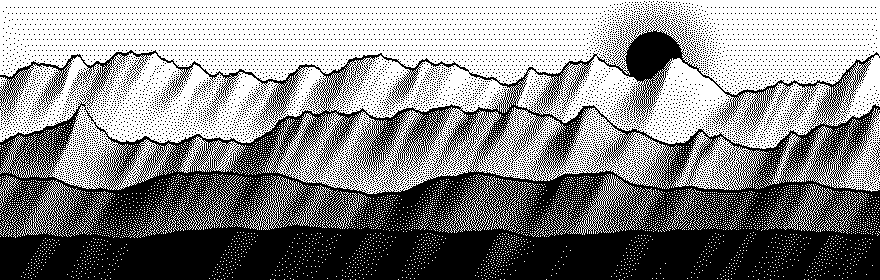
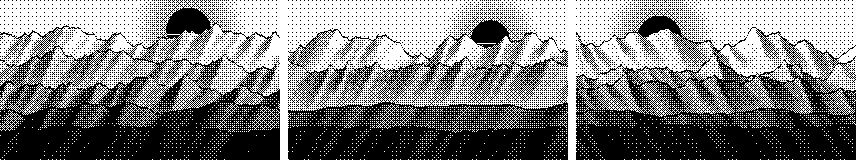
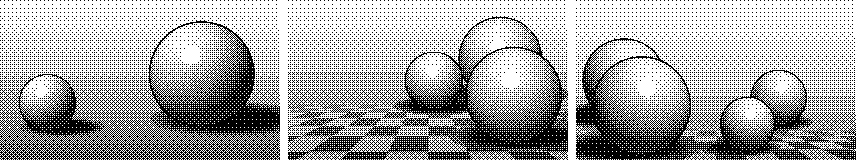
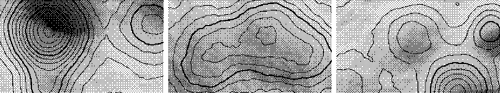
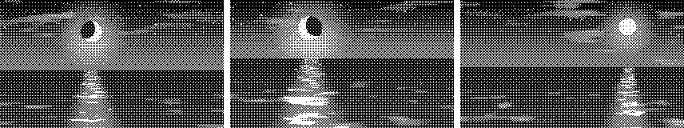
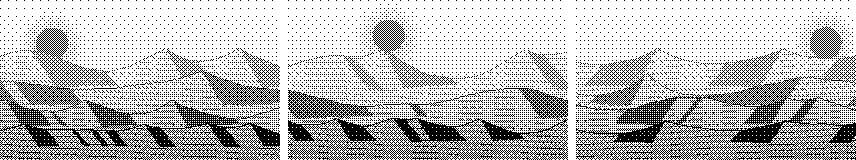
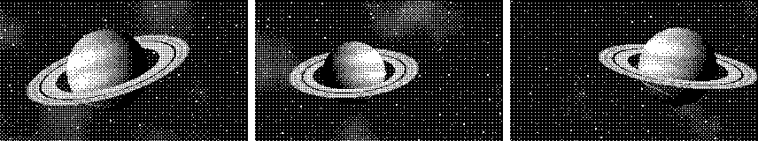
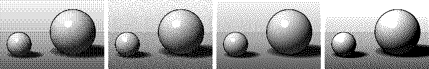

# dither-art

Seeded 1-bit artwork, drawn from any string. The same seed and size always give the same picture, so you can give
every user, post, product or college its own cover art without storing an image.



- **Six scenes**: mountain ridges, lit orbs, contour maps, a moonlit sea, desert dunes and a ringed planet
- **Four dithering methods**: Bayer, blue noise, Floyd–Steinberg and Atkinson
- **SVG and RGBA output**, so it works on the server, in a canvas, or inline in HTML
- **Deterministic everywhere**: tested to draw identical pixels on Node, Bun and Deno
- **Zero dependencies**, about 6 KB minified and gzipped, TypeScript types included (TypeScript 5.7 or later)

**[Website](https://pg-momik.github.io/dither-art/) · [Playground](https://pg-momik.github.io/dither-art/playground/)**

## Install

```bash
npm install dither-art
```

The package is ESM-only and needs Node 18 or later, or any modern browser, Bun, Deno or edge runtime.

## Quick start

```ts
import { ditherPixels, toSVG } from "dither-art";

const pixels = ditherPixels(320, 180, "my-seed"); // Uint8Array, 1 = ink, 0 = paper
const svg = toSVG(pixels, 320, 180); // ink is currentColor, paper is transparent

document.querySelector("#cover")!.innerHTML = svg;
```

Because the ink is `currentColor` by default, the picture takes the colour of the text around it, so it follows your
theme and dark mode with no extra work:

```css
#cover {
  color: var(--accent);
}
#cover svg {
  width: 100%;
  height: auto;
}
```

## Scenes

Leave `scene` out and the seed picks one (`sceneForSeed(seed)` tells you which). Each row below is one scene drawn
from three seeds.

| Scene | |
| --- | --- |
| `"ridges"`: layered mountain ranges under a sun, lit faces and misty valleys |  |
| `"orbs"`: lit spheres with shadows and highlights, sometimes on a checkerboard |  |
| `"contours"`: a survey map with hillshading and a heavier line every fifth level |  |
| `"sea"`: a night sea with stars, cloud streaks and a path of moonlit glints |  |
| `"dunes"`: desert dunes with slip-face shadows and wind ripples |  |
| `"planet"`: a banded, ringed planet in a starfield, with the rings' shadow |  |

## Dithering methods



| Method | Look | Notes |
| --- | --- | --- |
| `"bayer"` (default) | Regular crosshatch, retro | The grain stays put when the size changes |
| `"blue-noise"` | Fine, even grain with no pattern | Same stability as Bayer. The 64×64 map is built on first use, in under 100 ms |
| `"floyd-steinberg"` | Smooth tones, most detail | Error diffusion: the grain reshuffles when the size changes |
| `"atkinson"` | Crisp and contrasty, like the original Macintosh | Error diffusion. Very light and very dark areas go solid |

## Sizes and speed

Scenes are drawn in proportional coordinates, so any size and aspect ratio works, from thumbnails to wide banners.
Lines, outlines and stars are kept at least one pixel wide, so small pictures stay readable; from about 240 px across,
each scene shows its full detail.

Drawing is synchronous. On a laptop a 400×200 picture takes 10–35 ms and a 1920×1080 one 110–420 ms, depending on the
scene. For large or crisp retro pictures, draw small and scale up without smoothing, which is faster and looks better:

```ts
import { ditherPixels, toSVG } from "dither-art";

const svg = toSVG(ditherPixels(320, 180, seed), 320, 180, { scale: 4 }); // 1280×720 on screen, 320×180 pixels
```

For a canvas, set `image-rendering: pixelated` on it in CSS. For many pictures at once, render them in a Web Worker,
or once on the server, and cache the SVG.

## Recipes

### Canvas

```ts
import { ditherPixels, toRGBA } from "dither-art";

const [w, h] = [320, 180];
const canvas = document.querySelector("canvas")!;
canvas.width = w;
canvas.height = h;
canvas.style.imageRendering = "pixelated";

const pixels = ditherPixels(w, h, "my-seed", { method: "atkinson" });
const rgba = toRGBA(pixels, { ink: "#c41e3a", paper: "#fdf6e3" });
canvas.getContext("2d")!.putImageData(new ImageData(rgba, w, h), 0, 0);
```

### Server-rendered image

```ts
import { ditherPixels, toSVG } from "dither-art";

// e.g. in a route handler for /cover/:id.svg
const pixels = ditherPixels(600, 315, `post-${id}`);
return new Response(toSVG(pixels, 600, 315, { ink: "#111", paper: "#fff", title: "Cover art" }), {
  headers: { "content-type": "image/svg+xml", "cache-control": "public, max-age=31536000, immutable" },
});
```

The SVG is also fine as a data URL: `` `data:image/svg+xml,${encodeURIComponent(svg)}` ``.

### Dither your own image

`dither` works on any grid of ink amounts from 0 (paper) to 1 (solid ink), such as a photo's brightness:

```ts
import { dither, toRGBA } from "dither-art";

const { data, width, height } = ctx.getImageData(0, 0, canvas.width, canvas.height);
const ink = new Float32Array(width * height);
for (let i = 0; i < ink.length; i++) {
  const [r, g, b] = [data[i * 4], data[i * 4 + 1], data[i * 4 + 2]];
  ink[i] = 1 - (0.2126 * r + 0.7152 * g + 0.0722 * b) / 255;
}
const pixels = dither(ink, width, height, "floyd-steinberg");
ctx.putImageData(new ImageData(toRGBA(pixels), width, height), 0, 0);
```

### Your own scene

A scene is a function that gets seeded randomness and the picture's shape, and returns the ink amount at each point.
`x` runs from 0 to `aspect` (width / height) and `y` from 0 at the top to 1 at the bottom:

```ts
import { ditherPixels, type Scene } from "dither-art";

const halo: Scene = (rand, { aspect, pixel }) => {
  const cx = aspect * (0.3 + rand() * 0.4);
  const r = 0.25 + rand() * 0.1;
  return (x, y) => {
    const d = Math.hypot(x - cx, y - 0.5);
    if (Math.abs(d - r) < Math.max(0.01, pixel)) return 1; // a ring at least a pixel wide
    return d < r ? 0.15 : Math.min(1, (d - r) * 1.5);
  };
};

const pixels = ditherPixels(320, 180, "my-seed", { scene: halo });
```

## API

### `ditherPixels(width, height, seed, options?)`

Draws a picture. Returns a `Uint8Array` of `width * height` pixels, row by row: `1` = ink, `0` = paper.

- `width`, `height`: size in pixels. Floored to whole numbers, and at least 1. Throws a `RangeError` for `NaN` or
  `Infinity`.
- `seed`: any string. The same seed gives the same picture.
- `options.scene`: a scene name (see [Scenes](#scenes)) or your own [`Scene`](#your-own-scene) function. Default:
  picked from the seed.
- `options.method`: `"bayer"` (default), `"blue-noise"`, `"floyd-steinberg"` or `"atkinson"`.
- `options.density`: how much ink, as a multiplier. Default `1`. Zero, negative or `NaN` gives a blank picture.

Unknown scene or method names throw a `TypeError` that lists the valid ones.

### `toSVG(pixels, width, height, options?)`

Returns the pixels as an SVG string: one `<path>` tracing each run of ink in a row as a one-pixel stroke, with
`shape-rendering="crispEdges"`. Dithered pictures are busy, so expect roughly 40–100 KB for 320×180, which compresses
to 3–6 KB with the gzip or Brotli your server or CDN already applies.

- `options.ink`: any CSS colour. Default `"currentColor"`.
- `options.paper`: any CSS colour for the background. Default: transparent.
- `options.scale`: displayed pixels per picture pixel, for the `width` and `height` attributes. Default `1`.
- `options.title`: an accessible name. Without one, the SVG is marked `aria-hidden="true"` as decoration.

### `toRGBA(pixels, options?)`

Returns a `Uint8ClampedArray` with 4 bytes (red, green, blue, alpha) per pixel, ready for `new ImageData(rgba, width,
height)`.

- `options.ink`: `"#rgb"`, `"#rgba"`, `"#rrggbb"`, `"#rrggbbaa"` or `[r, g, b, a?]` (0–255). Default `"#000"`.
- `options.paper`: same formats. Default: transparent.

### `dither(ink, width, height, method?)`

Dithers your own grid of ink amounts (`0`–`1`, row by row) with any method. Values outside `0`–`1` are clamped and
`NaN` counts as paper. Throws a `RangeError` if `ink.length` is not `width * height`.

### Other exports

- `sceneForSeed(seed)`: the scene a seed gets when none is given.
- `ridges`, `orbs`, `contours`, `sea`, `dunes`, `planet`: the built-in scenes, as `Scene` functions to wrap or
  combine.
- `hashSeed(string)`: FNV-1a 32-bit hash.
- `seededRandom(seed)`: a mulberry32 generator of numbers in `[0, 1)`, from a 32-bit integer seed.
- `blueNoiseMap()`: the 64×64 blue-noise threshold map (`Float32Array`, values in `(0, 1)`).
- `BAYER`: the 8×8 Bayer thresholds (64 numbers in `(0, 1)`, row by row).
- `DITHER_SCENES`, `DITHER_METHODS`: the scene and method names.
- Types: `DitherScene`, `DitherMethod`, `DitherOptions`, `Scene`, `SceneContext`, `Field`, `SvgOptions`,
  `RgbaOptions`, `Colour`.

## Stability

Pictures are part of the API: within a major version, a seed, size, scene and method always draw exactly the same
pixels. The test suite pins a hash of every scene and method, and CI checks them on Node 18–22, Bun and Deno. Any
change to how pictures look is a major release.

Leaving `scene` out lets the seed choose from all scenes, so adding a scene in a later major version can change which
scene a seed gets. Pass `scene` explicitly if you need a picture to never change across major versions.

## Development

```bash
npm install
npm test              # unit tests and picture snapshots
npm run typecheck     # types, tests included
npm run gallery       # re-render the README images (docs/) and the site's link preview
node scripts/snapshot.mjs --update   # after an intended change to how pictures look
```

The website and playground live in `site/`. Run `npm run site` to copy the build into `site/lib/`, then serve `site/`
with any static server, for example `npx serve site`. A GitHub Actions workflow publishes it to GitHub Pages.

## License

[MIT](LICENSE)
